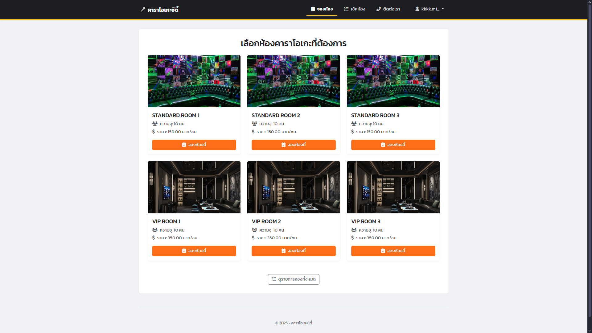
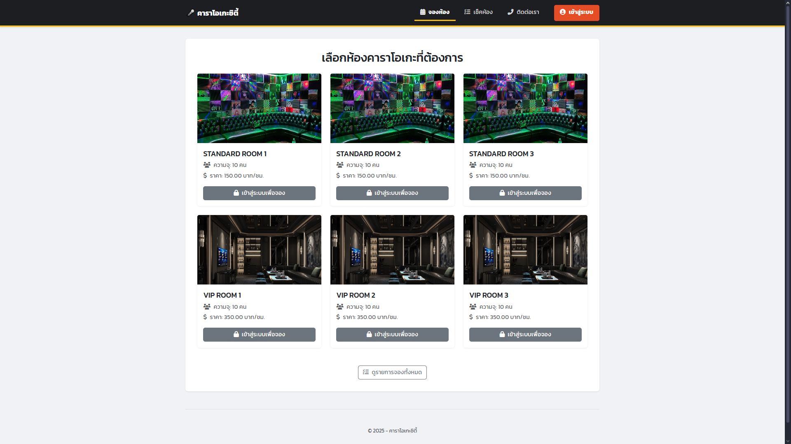
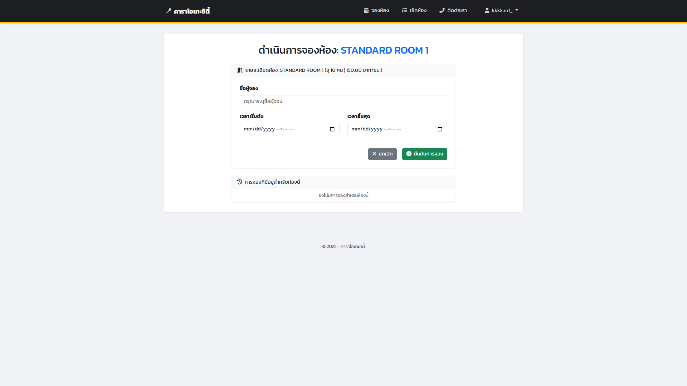
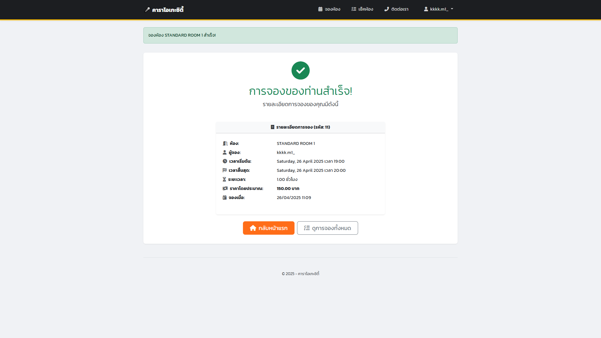
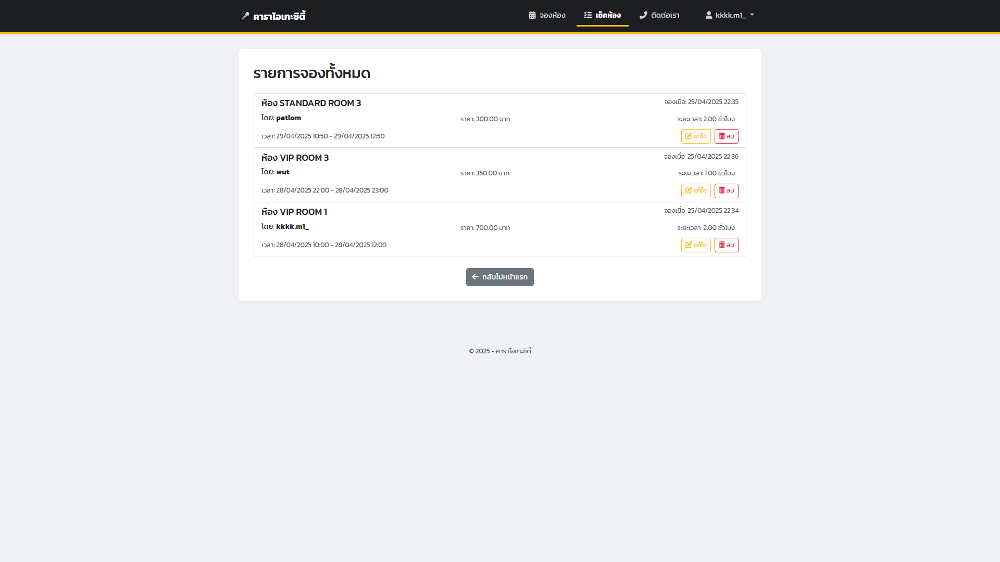

<h1 align="center">🎤 คาราโอเกะซิตี้ - ระบบจองห้องคาราโอเกะด้วย Django</h1>
<p align="center">
  
</p>

<p align="center">
  ระบบจองเว็บคาราโอเกะ
</p>

---

## 🧠 Stack ที่ใช้

- 💻 Django (Back-end)
- 🎨 Bootstrap 5 (Front-end)
- 🗄 SQLite (Database dev mode)
- 🔐 ระบบ Auth แยก User และ Admin

---

## 🚀 ฟีเจอร์หลัก

 ✅ ระบบสมัครสมาชิก / ล็อกอิน / ลืมรหัสผ่าน (ผ่านอีเมล)  
 ✅ ระบบบังคับ login ก่อนจอง
 ✅ รายการจองทั้งหมด
 ✅ ระบบคำนวณ ราคาและเวลาที่จอง

---

## 🖼 ตัวอย่างหน้าจอระบบ

### 🎮 หน้าแรกเว็บไซต์ก่อนล็อกอิน



### 🔐 หน้าล็อกอิน


### 📝 สมัครสมาชิก


### 🎮 หน้าเลือกจองห้อง


### 💳 ฟอร์มจองห้องคาราโอเกะ



### 💰 หน้าเมื่อจองห้องเสร็จ



### 📜 ประวัติการจองทั้งหมด



### 🛠 ติดต่อ/แจ้งปัญหา


---

## 🧱 โครงสร้างโปรเจกต์ (บางส่วน)
```
kraoke_project/
├── accounts/                           # ระบบผู้ใช้
├── booking/                            # ฟังก์ชันในการจองทั้งหมด
├── booking/templates/                  # ฟอร์มติดต่อทีมงาน
│           ├── base.html               # Navbar & Footer
│           ├── all_bookings.html       # การจองทั้งหมด
│           ├── booking_form.html       # ฟอร์มการจอง
│           ├── booking_success.html    # หน้าเมื่อจองเสร็จ
│           └── room_list.html          # รายการห้องให้เลือกจอง
└── README.md
```

---

## 🚀 วิธีรันโปรเจกต์ (Dev Mode)

### 1. ติดตั้ง Django
```bash
pip install django
```

### 2. รัน migration และสร้าง superuser
```bash
python manage.py migrate
python manage.py createsuperuser
```

### 3. รันเซิร์ฟเวอร์
```bash
python manage.py runserver
```

---

## 💌 ติดต่อผู้พัฒนา

<div align="center">

<table>
  <tr>
    <td align="center"><strong>📧 Email</strong></td>
    <td><a href="mailto:minkridsada233@gmail.com">minkridsada233@gmail.com</a></td>
    <td><a href="mailto:wuttipatphuakmaneeo@gmail.com">wuttipatphuakmaneeo@gmail.com</a></td>
    <td><a href="mailto:Teeraphat15.km@gmail.com">Teeraphat15.km@gmail.com</a></td>
  </tr>
  <tr>
    <td align="center"><strong>🪪 GitHub</strong></td>
    <td><a href="https://github.com/minkpn">minkpn</a></td>
    <td><a href="https://github.com/wuttipatphuakmanee">Wuttipat</a></td>
    <td><a href="https://github.com/Teerapatkm">Patlom</a></td>
  </tr>
  <tr>
    <td align="center"><strong>💬 Line</strong></td>
    <td>@minkpn</td>
    <td>@Wuttipat</td>
    <td>@Patlom</td>
  </tr>
</table>

</div>

---

<h1 align="center">✨ Made with ❤️ by minkpn x uttipat x Patlom</h1>
